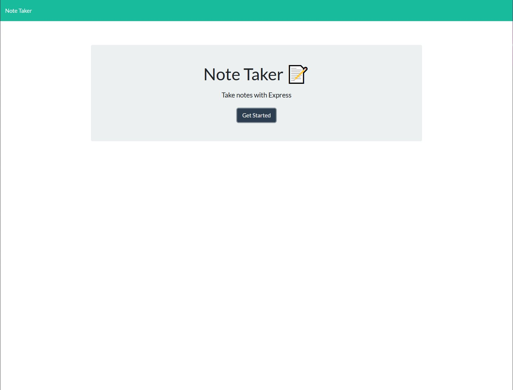
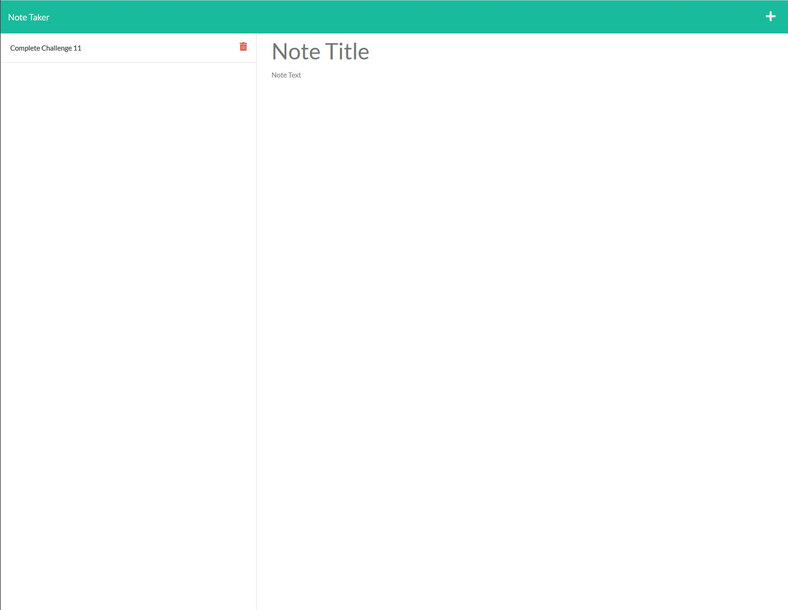

# Note Taker

  ## Table of Content
  * [Description](#description)
  * [Links](#links)
  * [Screenshots](#screenshots)

## Description
Note Taker is an application that lets you view saved notes, save new notes and delete notes. This application is build with express for the backend and HTML & CSS for the front end.

## Links
[Note Taker App](https://note-taker-ucf.herokuapp.com/)

## Screenshots

### Index HTML

### Notes HTML

